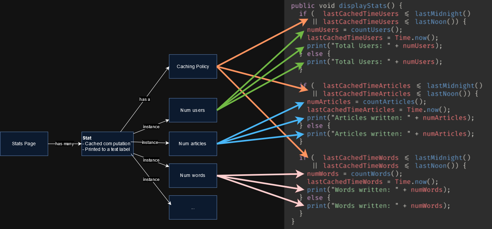
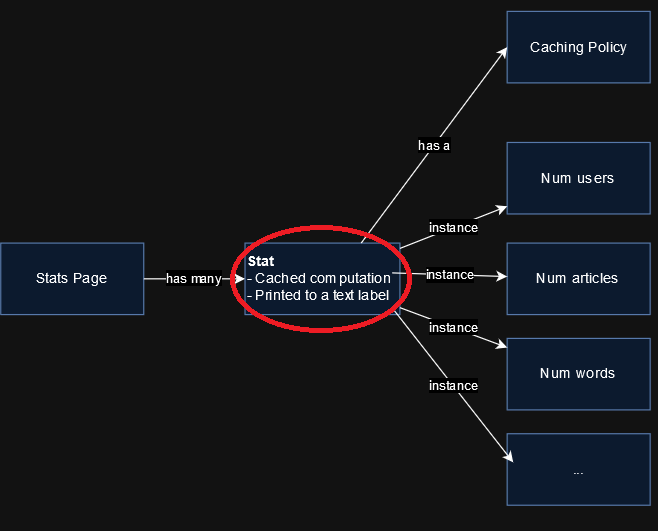

Contents
---
<!-- incremental_lists: true -->

<!-- pause -->
- Quiz from last talk
- Goals
- Motivating Example
- Capturing Design from Code
- From Design Back to Code
- EDP-compliant Code
- The Plain English Test
- Linguistic Antipatterns
- Review
- Resources

Quiz from last talk
---
<!-- incremental_lists: true -->

- Q: How can a program that never goes wrong still be wrong?
  - A: Errors in modular reasoning
- Q: What kind of bug does an error in modular reasoning produce?
  - A: A bug where a program works now but it might break in the future.
- Q: Modular reasoning lets an engineer...
  - A. Make smaller classes, functions, and files.
  - B. Feel smarter
  - C. Reason about code correctness without reading the rest of the program.
     - Answer: C
- Q: What does Level 1 of program correctness say?
  - A: "A program is incorrect if it runs and produces a wrong result."
- Q: What does Level 2 of program correctness say?
  - A: "A program is incorrect if there exists some environment or input under which it produces a wrong result."
- Q: What does Level 3 of program correctness say?
  - A: "A program is incorrect if the reasoning for why it should be correct is flawed."

Goals
---
<!-- incremental_lists: true -->

<!-- pause -->
- Show that design exists apart from the code
- Show why it's hard to extract a design from code
- Show how to embed design in code

Motivating Example
---
<!-- incremental_lists: true -->


<!-- pause -->
- AwesomeSauce (not real) is a growing blog site. 
- They have a stats page which updates once a day.


Motivating Example
---


<!-- pause -->
Bob works at AwesomeSauce. 

<!-- pause -->
Here is his code for the stats page. He says "It's easy to add or remove stats; just copy-paste!"

<!-- pause -->
Do you agree?

<!-- pause -->
```javascript
public void displayStats() {
  if (lastCachedTime <= lastMidnight()) {
    numUsers = countUsers();
    lastCachedTime = Time.now();
    print("Total Users: " + numUsers);
  } else {
    print("Total Users: " + numUsers);
  }

  if (lastCachedTime <= lastMidnight()) {
    numArticles = countArticles();
    lastCachedTime = Time.now();
    print("Articles written: " + numArticles);
  } else {
    print("Articles written: " + numArticles);
  }

  if (lastCachedTime <= lastMidnight()) {
    numWords = countWords();
    lastCachedTime = Time.now();
    print("Words written: " + numWords);
  } else {
    print("Words written: " + numWords);
  }
}
```

Motivating Example
---


In code review, Bob's coworker Charlie points out a bug:

<!-- pause -->
The re-use of `lastCachedTime` breaks the articles and words count. 

<!-- pause -->
Bob fixes it.

<!-- column_layout: [1, 1] -->

<!-- column: 0 -->
<!-- pause -->
### Before
<!-- pause -->
```javascript
public void displayStats() {
  if (lastCachedTime <= lastMidnight()) {
    numUsers = countUsers();
    lastCachedTime = Time.now();
    print("Total Users: " + numUsers);
  } else {
    print("Total Users: " + numUsers);
  }

  if (lastCachedTime <= lastMidnight()) {
    numArticles = countArticles();
    lastCachedTime = Time.now();
    print("Articles written: " + numArticles);
  } else {
    print("Articles written: " + numArticles);
  }

  if (lastCachedTime <= lastMidnight()) {
    numWords = countWords();
    lastCachedTime = Time.now();
    print("Words written: " + numWords);
  } else {
    print("Words written: " + numWords);
  }
}
```
<!-- column: 1 -->
<!-- pause -->
### After
<!-- pause -->
```javascript
public void displayStats() {
  if (lastCachedTimeUsers <= lastMidnight()) {
    numUsers = countUsers();
    lastCachedTimeUsers = Time.now();
    print("Total Users: " + numUsers);
  } else {
    print("Total Users: " + numUsers);
  }

  if (lastCachedTimeArticles <= lastMidnight()) {
    numArticles = countArticles();
    lastCachedTimeArticles = Time.now();
    print("Articles written: " + numArticles);
  } else {
    print("Articles written: " + numArticles);
  }

  if (lastCachedTimeWords <= lastMidnight()) {
    numWords = countWords();
    lastCachedTimeWords = Time.now();
    print("Words written: " + numWords);
  } else {
    print("Words written: " + numWords);
  }
}
```
<!-- reset_layout -->

Motivating Example
---


6 months later, Marketing says "We need to update the stats twice a day."

<!-- pause -->
Charlie implements the change.

<!-- column_layout: [1, 1] -->

<!-- column: 0 -->
<!-- pause -->
### Before
<!-- pause -->
```javascript
public void displayStats() {
  if (lastCachedTimeUsers <= lastMidnight()) {
    numUsers = countUsers();
    lastCachedTimeUsers = Time.now();
    print("Total Users: " + numUsers);
  } else {
    print("Total Users: " + numUsers);
  }

  if (lastCachedTimeArticles <= lastMidnight()) {
    numArticles = countArticles();
    lastCachedTimeArticles = Time.now();
    print("Articles written: " + numArticles);
  } else {
    print("Articles written: " + numArticles);
  }

  if (lastCachedTimeWords <= lastMidnight()) {
    numWords = countWords();
    lastCachedTimeWords = Time.now();
    print("Words written: " + numWords);
  } else {
    print("Words written: " + numWords);
  }
}
```
<!-- column: 1 -->
<!-- pause -->
### After
<!-- pause -->
```javascript
public void displayStats() {
  if (  lastCachedTimeUsers <= lastMidnight() 
     || lastCachedTimeUsers <= lastNoon()) {
    numUsers = countUsers();
    lastCachedTimeUsers = Time.now();
    print("Total Users: " + numUsers);
  } else {
    print("Total Users: " + numUsers);
  }

  if (  lastCachedTimeArticles <= lastMidnight() 
     || lastCachedTimeArticles <= lastNoon()) {
    numArticles = countArticles();
    lastCachedTimeArticles = Time.now();
    print("Articles written: " + numArticles);
  } else {
    print("Articles written: " + numArticles);
  }

  if (  lastCachedTimeWords <= lastMidnight() 
     || lastCachedTimeWords <= lastNoon()) {
    numWords = countWords();
    lastCachedTimeWords = Time.now();
    print("Words written: " + numWords);
  } else {
    print("Words written: " + numWords);
  }
}
```
<!-- reset_layout -->

Motivating Example
---


6 months later, Charlie refactors the code to "Be more DRY." 

He rightly says, "Besides, the page only shows one `Last updated` value."

<!-- column_layout: [1, 1] -->

<!-- column: 0 -->
<!-- pause -->
### Before
<!-- pause -->
```javascript
public void displayStats() {
  if (  lastCachedTimeUsers <= lastMidnight() 
     || lastCachedTimeUsers <= lastNoon()) {
    numUsers = countUsers();
    lastCachedTimeUsers = Time.now();
    print("Total Users: " + numUsers);
  } else {
    print("Total Users: " + numUsers);
  }

  if (  lastCachedTimeArticles <= lastMidnight() 
     || lastCachedTimeArticles <= lastNoon()) {
    numArticles = countArticles();
    lastCachedTimeArticles = Time.now();
    print("Articles written: " + numArticles);
  } else {
    print("Articles written: " + numArticles);
  }

  if (  lastCachedTimeWords <= lastMidnight() 
     || lastCachedTimeWords <= lastNoon()) {
    numWords = countWords();
    lastCachedTimeWords = Time.now();
    print("Words written: " + numWords);
  } else {
    print("Words written: " + numWords);
  }
}
```

<!-- column: 1 -->
<!-- pause -->
### Before
<!-- pause -->
```javascript
public void displayStats() {
   calculateStats();
   renderStats();
}

private void calculateStats() {
  if (  lastCachedTime <= lastMidnight() 
     || lastCachedTime <= lastNoon()) {
    numUsers = countUsers();
    numArticles = countArticles();
    numWords = countWords();
    lastCachedTime = Time.now();
  }
}

private void renderStats() {
  print(numUsers);
  print(numArticles);
  print(numWords);
}
```
<!-- reset_layout -->

Motivating Example
---


A year later: A new requirement: Marketing surveys show nobody uses "Words written". 

<!-- pause -->
Bob removes it, but he introduces a bug, which goes unnoticed.

<!-- column_layout: [1, 1] -->

<!-- column: 0 -->
<!-- pause -->
### Before
<!-- pause -->
```javascript
public void displayStats() {
   calculateStats();
   renderStats();
}

private void calculateStats() {
  if (  lastCachedTime <= lastMidnight() 
     || lastCachedTime <= lastNoon()) {
    numUsers = countUsers();
    numArticles = countArticles();
    numWords = countWords();
    lastCachedTime = Time.now();
  }
}

private void renderStats() {
  print(numUsers);
  print(numArticles);
  print(numWords);
}
```
<!-- column: 1 -->
<!-- pause -->
### Before
<!-- pause -->
```javascript
public void displayStats() {
   calculateStats();
   renderStats();
}

private void calculateStats() {
  if (  lastCachedTime <= lastMidnight() 
     || lastCachedTime <= lastNoon()) {
    numUsers = countUsers();
    numArticles = countArticles();
    numWords = countWords();
    lastCachedTime = Time.now();
  }
}

private void renderStats() {
  print(numUsers);
  print(numArticles);
}
```
<!-- reset_layout -->

Motivating Example
---
<!-- incremental_lists: true -->


- A year later, AwesomeSauce goes viral. Users increase 10x, as does server load.
- SREs notice latency spikes at noon and midnight. The stats page takes 3 minutes to load.
- SREs discover with horror: the call to `countWords()` is still present, though its results are unused.

<!-- pause -->
```javascript
public void displayStats() {
   calculateStats();
   renderStats();
}

private void calculateStats() {
  if (  lastCachedTime <= lastMidnight() 
     || lastCachedTime <= lastNoon()) {
    numUsers = countUsers();
    numArticles = countArticles();
    numWords = countWords(); // Never used!
    lastCachedTime = Time.now();
  }
}

private void renderStats() {
  print(numUsers);
  print(numArticles);
}
```

Capturing Design from Code
---

<!-- pause -->
How could the design of the Stats page have prevented this bug?

<!-- pause -->
How can AwesomeSauce prevent future bugs on the Stats page?

<!-- pause -->
We will follow the Re-Engineering process to find out.

<!-- pause -->


<!-- pause -->
Let's start by extracting the current design from Bob and Charlie's code.

Capturing Design from Code
---

Clearly, there is a concept of a Stats page

Capturing Design from Code
---

A Stat seems to be a cached computation, printed next to a label

Capturing Design from Code
---

The caching policy can be changed. (Remember that Charlie did so.)

Capturing Design from Code
---

There are a variable number of stats. (Remember that Bob removed "Words written".)

Capturing Design from Code
---

In Bob's original code, each Stat seems to have its own caching policy.

Capturing Design from Code
---

There is a section concerning user count.

Capturing Design from Code
---

There is a section concerning article count.

Capturing Design from Code
---

There is a section concerning word count.

Capturing Design from Code
---


Notice that Charlie's refactoring actually implied a design change.

<!-- pause -->
In this design, there is just one caching policy for the page, instead of one for each stat.

Capturing Design from Code
---


The diagram makes it clear that hidden coupling led to the orphan call to `countWords()`.

<!-- pause -->
Principle: **Any lines of code influenced by the same design elements are coupled. They should be kept together.**

<!-- pause -->
Principle: **Code units A and B are coupled if, whenever A changes, B is also likely to change.**

From Design back to Code
---


<!-- pause -->
Now that we have reverse-engineered the design concepts, though possibly imperfectly, let's forward-engineer a new implementation.

<!-- pause -->
The goal is to *record our design intentions in the code.*

From Design back to Code
---


```csharp
public interface IStatComputation { int Run(); }
public class CountUsersComputation() { ... }
public class CountArticlesComputation() { ... }
public class CountWordsComputation() { ... }
```

<!-- pause -->
The *cached computation* design element can be expressed with an interface and three implementations.

From Design back to Code
---


```csharp
public interface ICachingPolicy() { 
  bool IsExpired(); 
  void Reset();
}

public class TwiceDailyCachingPolicy() { ... }
```

<!-- pause -->
The *caching policy* design element can be expressed with an interface and the only implementation.

From Design back to Code
---


```csharp
public class Stat(
  ICachingPolicy policy, 
  IStatComputation computation, 
  string label) {

  public string Label => label;

  private int value;

  public int GetValue() {
    if (policy.IsExpired()) {
      policy.Reset();
      value = computation.Run();
    }

    return value;
  }
}
```

<!-- pause -->
The *stat* design element can be expressed with a class which aggregates a policy, computation, and label.

From Design back to Code
---


```csharp
public class StatsPage(List<Stat> stats) {
  public string Render() 
     => stats.Map(s => $"<b>{s.Label}: </b> {s.GetValue()}");
}
```

<!-- pause -->
The *stats page* design element can be expressed with a class that renders each stat to HTML.

From Design back to Code
---
<!-- incremental_lists: true -->


```javascript
var policy = new TwiceDailyCachingPolicy();

var page = new StatsPage(
  new List<Stat> {
    new Stat(policy, new CountUsersComputation(), "Total Users"),
    new Stat(policy, new CountArticlesComputation(), "Articles written"),
    new Stat(policy, new CountWordsComputation(), "Words written")) 
  });

page.Render();
```
<!-- pause -->
We create an instance of Stat for each of: Users, Articles, Words.

From Design back to Code
---
<!-- incremental_lists: true -->

Here are the overall changes.

<!-- column_layout: [1, 2] -->

<!-- column: 0 -->
<!-- pause -->
### Before
<!-- pause -->
```javascript
public void displayStats() {
   calculateStats();
   renderStats();
}

private void calculateStats() {
  if (  lastCachedTime <= lastMidnight() 
     || lastCachedTime <= lastNoon()) {
    numUsers = countUsers();
    numArticles = countArticles();
    numWords = countWords();
    lastCachedTime = Time.now();
  }
}

private void renderStats() {
  print(numUsers);
  print(numArticles);
  print(numWords);
}

displayStats();
```
<!-- column: 1 -->
<!-- pause -->
### After
<!-- pause -->
```javascript
var policy = new TwiceDailyCachingPolicy();

var page = new StatsPage(
  new List<Stat> {
    new Stat(policy, new CountUsersComputation(), "Total Users"),
    new Stat(policy, new CountArticlesComputation(), "Articles written"),
    new Stat(policy, new CountWordsComputation(), "Words written")) 
  });

page.Render();
```
<!-- reset_layout -->

<!-- pause -->
- Q: What is different?
  - **A: The design is obvious from the code.**
- Q: How would we remove the "Words written" stat?
  - **A: Remove that *one line*. It's not possible to remove the label but leave the computation.**
- Q: How would we use a different cache policy for each stat?
  - **A: Provide a different instance to each constructor.**

The Plain English Test
---

<!-- pause -->

Principle: **The code should match a plain-English description of the design intent.**

<!-- pause -->
Technique: When you encounter messy code, ask "How would I describe the intent of this code in plain English?" 

<!-- pause -->
This bootstraps thinking at the design level.

<!-- pause -->
Then, make the code match the description.

EDP-compliant Code
---

<!-- pause -->
Your program was written via some tree of *assumptions* and *decisions*.

<!-- pause -->
Principle: **The easier it is to reverse-engineer the design tree from the code, the more *EDP-compliant* it is.**

EDP-compliant Code
---

True story:

<!-- pause -->
I worked at a medical device manufacturer for 5 years. 

<!-- pause -->
Being accountable to the FDA, we had reams of design documents and process. The company treated these as primary artifacts, i.e. version-controlled and just as valuable as the code.

<!-- pause -->
The were all lost in a ransomware attack.

<!-- pause -->
All that was left was the code in our local `.git` folders.

<!-- pause -->
How would you recreate those documents just from code?

<!-- pause -->
You'd better hope its design is embedded in the code.

EDP-compliant Code
---
<!-- incremental_lists: true -->

True story: A codebase had a global lock for two DBs. People knew it was suboptimal, but nobody dared changed it.

<!-- column_layout: [1, 1] -->

<!-- pause -->
<!-- column: 0 -->
```c
try {
  clusterLock.acquire();
  locationDb.update();
} finally {
  clusterLock.release();
}
```

<!-- pause -->
<!-- column: 1 -->
```c
try {
  clusterLock.acquire();
  paymentsDb.update();
} finally {
  clusterLock.release();
}
```
<!-- reset_layout -->

<!-- pause -->
*Chesterton's Fence* \[1\]: Don't remove code until you know why it's there.

<!-- pause -->
A hard-working dev reversed the design tree for above:

<!-- pause -->
- Prevent interference for location db access
  - Satified by a lock for location actions
    - Satified by a global lock
- Prevent intererence for payment db access
  - Satisfied by a lock for payment actions
    - Satified by a global lock

<!-- pause -->
Givent the design, the dev refactored to:

```c
Lock lockFor(Resource r) {
  return clusterLock;
}
```

<!-- pause -->
```c
Lock lock = lockFor(Resources.LocalDb)
try {
  lock.acquire();
  locationDb.update();
} finally {
  lock.release();
}
```

<!-- pause -->
*Corollary to Chesterton's Fence*: Avoid putting up unnecessary fences

<!-- pause -->
\[1\] https://www.chesterton.org/taking-a-fence-down/


Linguistic Antipatterns
---
<!-- incremental_lists: true -->

<!-- pause -->
- Since code is just text, design intentions end up expressed as words.
  - Names of variables, properties, methods, classes, assemblies, etc.
- Bad names create confusion, frustration, and bugs.

<!-- pause -->
*Linguistic Antipattern* \[1\] categories:

<!-- pause -->
- Confusable methods
- Inappropriately-specific name
- Incorrect associated spec
- Missing implied return type
- Name/type mismatch
- Unexpected side effects
- Method name is not a Verb

<!-- pause -->
\[1\] https://www.linguistic-antipatterns.com/

Linguistic Antipatterns > Confusable Methods
---

<!-- pause -->
> A class or namespace has two functions with similar names.

<!-- pause -->
Python `Thread.start()` vs `Thread.run()`:

<!-- pause -->
```python
Thread myThread = new Thread(() => doSomethingExpensive());
myThread.run(); # Runs in this thread!
```

Linguistic Antipatterns > Inappropriately-specific name
---

<!-- pause -->
> The usage of a parameter, field, or function is more general than its name implies.

<!-- pause -->
```csharp
public void ShowNotification(string englishMessage) { ... } // Could just be "message"

public void Authenticate(string userEmail) { ... } // Could just be "userId"
```

Linguistic Antipatterns > Incorrect associated spec
---
<!-- incremental_lists: true -->

<!-- pause -->
> A function has a name which strongly implies it has some property which the function does not.

<!-- pause -->
These names imply a certain specification:

- `init()`
- `open()`
- `connect()`

<!-- pause -->
In Ktorm (Kotlin library)

```kotlin
// Doesn't connect. It returns an object which can connect.
val database = Database.connect(
    url = "jdbc:mysql://localhost:3306/ktorm",
    driver = "com.mysql.jdbc.Driver",
    user = "root",
    password = "***"
)
```
Linguistic Antipatterns > Missing implied return type
---
<!-- incremental_lists: true -->

<!-- pause -->
> The name of a function strongly suggests a return type, but the function has no return value.

<!-- pause -->
> ...it suggests the codebase relies too heavily on mutation

<!-- pause -->
```csharp
protected void GetStatus() { status = ... }
public void IsValid(Thing thing) => thing.IsValid = ...;
```

Linguistic Antipatterns > Name/type mismatch
---
<!-- incremental_lists: true -->

<!-- pause -->
> The name of function/parameter/field X strongly suggests a type, but it has a different type.

<!-- pause -->
```csharp
public SomethingType IsSomething() { ... } // Should return bool
public bool SetSomething() { ... } // Should return void, or be `TrySetSomething`
public List<State> GetState() { ... } // Should be `GetStates`
public ControlEnableState Disable() { ... } // Confusing antonym
```

<!-- pause -->
In old versions of curl, `CURLOPT_SSL_VERIFYHOST` was dangerous.
<!-- pause -->
- Reads like values could be `true` or `false`
- In reality it can be `0`, `1` or `2`
  - `0` => disabled, 
  - `1` => does not check Cert Authority,
  - `2` => full check
- `true` maps to `1` in C
- Many programs were vulnerable to MITM attacks

Linguistic Antipatterns > Unexpected side effects
---
<!-- incremental_lists: true -->

> The name of a function suggests that it is pure, but it actually has an effect such as modifying shared state.

<!-- pause -->
From Django:

```python
def get_wsgi_application():
    django.setup(set_prefix=False)
    return WSGIHandler()

# At app start
get_wsgi_application()
```
Linguistic Antipatterns > Method name is not a Verb
---
<!-- incremental_lists: true -->

> Because they are behavior, methods and function names should be verbs.

<!-- pause -->
```csharp
public void ButtonClickHandler() { ... } // Try `HandleButtonClicked`

System.Windows.Forms.WndProc(Message m); // Try `ProcessWindowMessage`

System.DateTime.UtcNow; // Try `GetUtcNow()`
```

<!-- pause -->
> Variables, fields, and properties should be nouns or adjectives

<!-- pause -->
```csharp
private bool _run; // Try `_isRunning`
```
Quiz
---
<!-- incremental_lists: true -->

<!-- pause -->
- Q: Code units A and B are coupled if, whenever ___ changes, ___ is also likely to change.
  - **A: A, B**
- Q: Your program was written via some tree of ___ and ___.
  - **A: assumptions, decisions**
- Q: The easier it is to ___ the design tree from the code, the more ___ it is.
  - **A: reverse-engineer, EDP-compliant**
- Q: The ___ checks if code matches its natural language description
  - **A: Plain English Test**
- Q: ___ Antipatterns describe poor choice of words in the code
  - **A: Linguistic**

Summary
---
<!-- incremental_lists: true -->

- 
<!-- pause -->
- We can infer a design from code, but it's lossy
- Expressing design concepts in code reduces the loss
- It also leads to better code

Resources
---

- [](https://www.pathsensitive.com/2018/02/making-bugs-impossible-illustrating.html)
- [](https://www.chesterton.org/taking-a-fence-down/)
- [](https://www.linguistic-antipatterns.com)
- [](https://www.slater.dev/a-design-is-a-mold-for-code/)


Discussion
---

