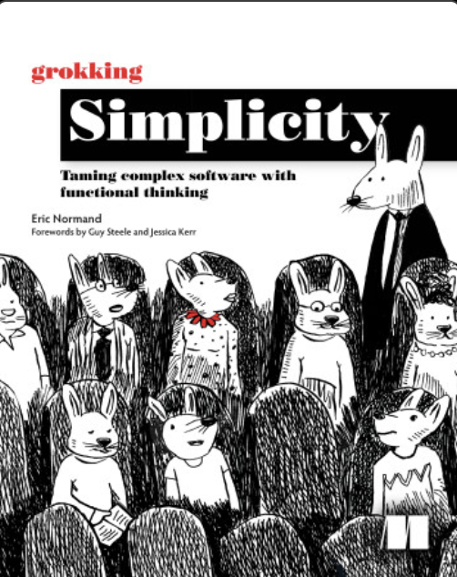
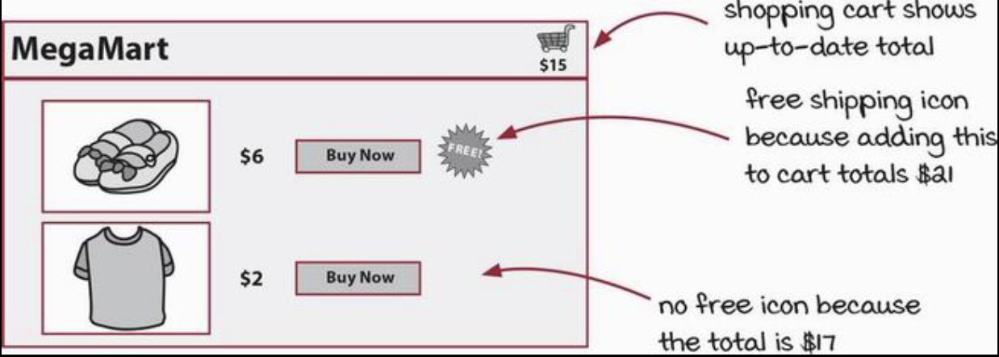
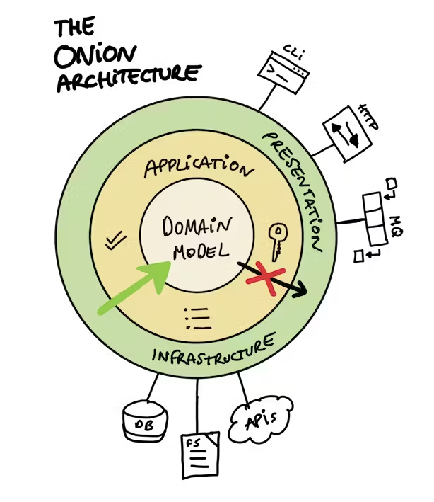

Contents
---
<!-- incremental_lists: true -->
<!-- pause -->

- Goals
- What is an Action?
- What is a Calculation?
- Refactoring Actions into Calculations
  - Meet MegaMart
  - MegaMart's Codebase
  - Refactored Codebase
- Higher-order functions
- But we need actions, right?
- Quiz
- Summary
- Resources

Goals
---
<!-- incremental_lists: true -->
<!-- pause -->

- Increase the quality of Climavision's products and make your life easier
- Show how to discern between calculations and actions
- Show how to extract calculations from actions
- Cover chapters 1-4 of *Grokking Simplicity*



What is an Action?
---
<!-- incremental_lists: true -->
<!-- pause -->

- Any code that depends on time.
  - When it is run
  - Order it is run
  - How many times it is run
- Also known as:
  - Impure functions
  - Stateful functions
  - Functions with side-effects

What is an Action?
---
<!-- incremental_lists: true -->

## Examples

<!-- pause -->
- I/O
  - Sending an email
  - Reading from or writing to a database
  - Reading from or writing to a file
  - Writing to the console
  - Making a web request
- Mutating state outside a function

<!-- pause -->
```csharp
public class StatefulCalculator
{
  public int Result { get; private set; }

  public void Divide(int x, int y) => Result = x / y;
}
```

<!-- pause -->
```csharp
var calc = new StatefulCalculator();
calc.Divide(8, 2);
Console.WriteLine(calc.Result); // Output: 4
```

What is an Action?
---
<!-- incremental_lists: true -->
<!-- pause -->

What's the problem with actions?

<!-- pause -->
- They are harder to test
- They make code hard to reason about (i.e. prove correct)
- They tend to rely on shared state, which leads to bugs

<!-- pause -->
```csharp
var calc = new StatefulCalculator();
var nums = Enumerable.Range(1, 100);
Parallel.ForEach(nums, num => 
{
    calc.Divide(num, 2);
    Console.WriteLine(calc.Result);
});
// Output: 1 2 2 3 46 47 47 48 48 49 3 
```

What is an Action?
---
<!-- incremental_lists: true -->
<!-- pause -->

How do we recognize actions?

<!-- pause -->
### Fact: Actions have **Implicit inputs and/or outputs**.

<!-- pause -->
- Implicit inputs: using data not passed to the function

<!-- pause -->
```csharp
public class StatefulCalculator
{
  public int Divisor { get; set; }
  public int Dividend { get; set; }

  // Implicit input
  public int Divide() => Divisor / Dividend;
}
```

<!-- pause -->
- Implicit outputs: setting data outside the function

<!-- pause -->
```csharp
public class StatefulCalculator
{
  public int Result { get; private set; }

  // Implicit output
  public void Divide(int x, int y) => Result = x / y;
}
```

What is an Action?
---
<!-- incremental_lists: true -->
<!-- pause -->

### Fact: Actions are infectious

- Functional programmers mentally label every function as *pure* or *impure*
- Any *impure* function makes all functions that call it impure
- e.g. if function `C` is an action, 
  - then function `B` which calls `C` is an action, 
  - then function `A` which calls `B` is an action, 

<!-- pause -->
```csharp
public class Foo
{
  public int A() => 1 + B(); // Pure
  public int B() => 2 + C(); // Pure
  public int C() => 3; // Pure
}
```

<!-- pause -->
```csharp
public class Foo
{
  public int A() => 1 + B(); // Impure
  public int B() => 2 + C(); // Impure
  public int C() => int.Parse(Console.ReadLine()); // Impure
}
```

What is a Calculation?
---
<!-- incremental_lists: true -->
<!-- pause -->

- Computations solely from inputs to outputs. 
- They only have **Explicit inputs and/or outputs.**
- They don't depend on time.
- They always produce the same result, given the same inputs.
  - i.e. they are **deterministic.**

<!-- pause -->
```csharp
public class StatelessCalculator
{
  // Only uses parameters and returns a value
  public static int Divide(int x, int y) => x / y;
}
```

<!-- pause -->
- They are **referentially transparent.**
  - Their return value can be substituted for the function call

<!-- pause -->
```csharp
// Referentially transparent
int quotient1 = StatelessCalculator.Divide(8, 2);
int quotient2 = 4;

quotient1 == quotient2; // true
```

<!-- pause -->
- Also known as:
  - Pure functions
  - Stateless functions
  - Mathematical functions

Refactoring Actions into Calculations 
---
<!-- incremental_lists: true -->
<!-- pause -->

### Fact: One can, by a sequence of *safe refactoring steps*, extract calculations out of actions.

<!-- pause -->
- The extracted code can then be reused or tested in isolation.

Meet MegaMart
---
<!-- incremental_lists: true -->
<!-- pause -->



- MegaMart is an online store. 
- MegaMart's distinctive feature is the shopping cart always shows the total price
- MegaMart also offers free shipping on orders of at least $20.
- MegaMart adds a FREE shipping icon next to each item that will bump the order to >= $20.

MegaMart's Codebase
---
<!-- incremental_lists: true -->
<!-- pause -->

- < Tour of MegaMart's codebase >
- Q: What's wrong with MegaMart's code?
- A: Business logic mixed in with DB and UI concerns
- A: It is not testable
  - Only verifiable through effects on the page
- A: It is not reusable
  - What if the Shipping dept wants to print shipping labels?
  - What if the Finance dept wants to print tax receipts?

Refactored Codebase
---
<!-- incremental_lists: true -->
<!-- pause -->

- < Tour of refactored MegaMart codebase >

- Q: What's better in this version?
- A: The extracted functions are:
  - easy to understand
  - easy to test in isolation
  - easy to reuse

Higher-order functions
---
<!-- incremental_lists: true -->
<!-- pause -->

- Pure functions (calculations) can be passed as parameters to other functions
- It does not work for actions
- The receiving functions are called *higher-order functions*
- C# example: LINQ Select
  - The designers of LINQ are functional programmers
  - LINQ was designed for pure functions

<!-- pause -->
```csharp

static decimal CalcTax(decimal amount) => amount * 0.10M;

List<decimal> prices = [ 5.00M, 10.00M, 15.00M, 20.00M ];
List<decimal> taxes = prices.Select(CalcTax).ToList();
```

<!-- pause -->
- Q: Would `Select` work if `CalcTax` had side-effects, e.g. if it sent an email?
- A: No. The side-effect would occur for each element in `prices`.
- A: Plus, it's hard to reason about and keep correct.

- Q: What happens if we remove the call to `ToList()`? 
- A: The enumeration is deferred. 
  - The enumeration will happen at some unknown time in the future.
  - The enumeration could happen possibly multiple times.
  - That's a lot of emails!

But we need actions, right?
---
<!-- incremental_lists: true -->
<!-- pause -->

- Yes. Software without actions is useless.
- In order to be useful, software must have some effect on the world.
  - e.g. text messages need to send
  - e.g. car engines need to run
  - e.g. What I bought online needs to show up at my house
- How do we do that while writing testable, reusable code?

<!-- pause -->
### Principle: **Push state and effects to application boundary.**

<!-- pause -->
- Has many names:
  - "Functional Core, Imperative Shell"
  - "Impureim Sandwich"
  - "Onion" / "Hexagonal" / "Ports-and-Adapters" / "Clean" architecture
- Pure logic at core
- Interaction with the world at exterior

<!-- pause -->


Summary
---
<!-- incremental_lists: true -->
<!-- pause -->

- Actions depend on time.
- Actions are infectious.
- Calculations don't depend on time
- Functional programmers naturally distinguish between Calculations and Actions.
- Functional programmers prefer Calculations over Actions.
- Calculations are easier to test and reason about.
- It is possible to refactor Actions into Calculations.
- We still need Actions, but we can isolate them.

> ...you should strive towards maximising the amount of pure functions you write, pushing the impure code to the edges of the system - Mark Seeman

Resources
---

- [](https://livebook.manning.com/book/grokking-simplicity)
- [](https://blog.itsjavi.com/target-software-architectures-the-onion-architecture)
- [](https://blog.ploeh.dk/2020/03/02/impureim-sandwich/)
- [](https://blog.ploeh.dk/2016/03/18/functional-architecture-is-ports-and-adapters/)

Discussion
---

