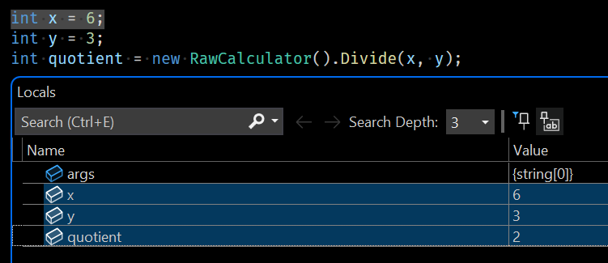
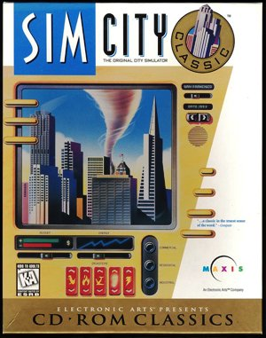

About Me
---
<!-- incremental_lists: true -->
<!-- pause -->
- Coding since 1999
- BS Computer Science 2013
- MS Computer Science 2014
- C#, C++, Python, more
- 10 years medical device software
  - robust QA
- 4 months at Climavision

Contents
---
<!-- incremental_lists: true -->

<!-- pause -->
- Intro
- Goals
- Motivating Quiz
- What is a Module?
- What is Modular Reasoning?
- Design-Level Thinking
- The Three Levels of Program Correctness
- Stable Guarantees
- Errors in Modular Reasoning
- Review Quiz
- Summary
- Resources

Goals
---
<!-- incremental_lists: true -->

<!-- pause -->
- Teach design-level thinking
- Improve code quality

Motivating Quiz
---
<!-- incremental_lists: true -->

<!-- pause -->
Question: As part of a large application, you are reading an input and need to escape all single quotes. Which of these two options is better and why? Assume both do the exact same thing.

<!-- pause -->
```python
  x = sanitize(readInput())
```

```python
  x = readInput().replaceAll("'", "\\'")
```

<!-- pause -->
- A: Option 1 because it’s shorter
- B: Option 1 because option 2 is incorrect, even though it always works
- C: Option 2 because it’s more clear what it does
- D: Option 2 because it’s more efficient, avoiding the function call overhead 

<!-- pause -->
3...
<!-- pause -->
2...
<!-- pause -->
1...

<!-- pause -->
**Answer: B**

<!-- pause -->
Question: How could something that always works be incorrect?

<!-- pause -->
**Answer: Errors in modular reasoning.**

<!-- pause -->
Source: [](https://mirdin.com/quizzes/software-design-quiz/)

Motivating Quiz
---
<!-- incremental_lists: true -->

<!-- pause -->
Question: Which is correct?

<!-- pause -->
```python
write(1, "foo", len)
```

```python
write(stdout, "foo", len)
```

<!-- pause -->
**Answer: The second**

<!-- pause -->
Question: Why?

<!-- pause -->
Answer: The first is incorrect because 

<!-- pause -->
- It is not possible to know that it works without making assumptions about the rest of the system.
- The number `1` is *a secret to another module*. 
- Even though it works now, this secret could change without notice.
- The idea of the number `1` and the idea of the stream `stdout` are different, even though they are the same in implementation *right now*.

<!-- pause -->
The *implementation/interface distinction* states that the guarantees of what a function must do are different from what it actually does.

Motivating Quiz
---

```python
  x = sanitize(readInput())
```

```python
  x = readInput().replaceAll("'", "\\'")
```

<!-- pause -->
The general idea of a sanitized string and the specific idea of a string with all single quotes escaped by a backslash are different. 

<!-- pause -->
The exact sanitization rules should be considered *a secret to its module* which could change without notice.

What is a Module?
---
<!-- incremental_lists: true -->

  - From PL (Programming Language) Theory
  - A unit of organization that can keep a secret
  - The secret is shared internally
  - The secret is concealed externally

What is a Module > Example Forms > Functions
---
<!-- incremental_lists: true -->

<!-- pause -->
  - local constants, calculations

```python
def sanitize(input_string):
  # the sanitization rules are a secret to this function
  return input_string.replace("'", "\\'")
```

What is a Module > Example Forms > Classes
---
<!-- incremental_lists: true -->

<!-- pause -->
  - `private`, `protected` members

```csharp
public class UsTaxCode : ITaxCode
{
  // A secret to the class
  private const int _retirementAge = 65;

  public bool IsRetirementAge(int age) => age > _retirementAge; 
}
```

<!-- pause -->
```csharp
public class AsciiTools
{
  // another secret
  private const int _minChar = 65;

  public bool IsAlphanumeric(int c) => c > _minChar;
}
```

<!-- pause -->
Question: These secrets are identical. Should they be merged?

<!-- pause -->
**Answer: No, because they have different reasons to change**.


What is a Module > Example Forms > Assemblies
---
<!-- incremental_lists: true -->

<!-- pause -->
  - e.g. .dll, .so files
  - `internal` members

```csharp
namespace MyProject;

// Cannot be referenced outside MyProject.dll
internal class ThisAssemblyOnly
{
  ...
}
```

What is a Module > Other Forms
---
<!-- incremental_lists: true -->

<!-- pause -->
- Sometimes literally named "Modules"
  - Early languages: ALGOL, OCaml, ML
  - Newer languages: JavaScript, Rust, C++20
- Sometimes called "Packages" (Dart, Go, Java)

What is Modular Reasoning?
---
<!-- incremental_lists: true -->

The ability to make decisions about a module while looking only at its implementation and the specification (i.e. interface, i.e. contract) of other modules.

<!-- pause -->
Modular reasoning lets an engineer reason about the correctness of a module without reading the rest of the program.

<!-- pause -->
Question: How big should a module be?

<!-- pause -->
**Answer: From cognitive science \[1\]\[2\], humans can hold about 7 pieces of information in short-term memory. Modules should hold up to that amount.**

<!-- pause -->
- \[1\] [](https://www.oreilly.com/library/view/code-that-fits/9780137464302/)
- \[2\] [](https://www.manning.com/books/the-programmers-brain)

Design-Level Thinking
---
<!-- incremental_lists: true -->

- **Key idea**: Design is apart from the code.
- Design is about a shared fiction
- Just like Democracy does not exist
  - US, Russia, and Ukranian Sovereignty
- Newton's Law of Gravity is just a model
  - and only approximately true at the scale of humans
- These are patterns imposed by our minds on the world
- Similarly, software design is a narrative over physical code
  - **There can be many code implementations that satisfy a design**

Design-Level Thinking > Example
---

> There can be many code implementations that satisfy a design

<!-- pause -->
Here's a specification.

```csharp
public interface ICalculator
{
  // Returns the integer quotient
  public int Divide(int x, int y);
}
```

<!-- pause -->
What's the difference between these two implementations?

```csharp
public class X : ICalculator
{
    public int Divide(int x, int y) => x / y;
}
```

```csharp
public class Y : ICalculator
{
    public int Divide(int x, int y) => y switch
    {
        0 => int.MaxValue,
        _ => x / y
    };
}
```

Design-Level Thinking > Example
---

> There can be many code implementations that satisfy a design

Here's a specification.

```csharp
public interface ICalculator
{
  // Returns the integer quotient
  public int Divide(int x, int y);
}
```

What's the difference between these two implementations?

```csharp
public class RawCalculator : ICalculator
{
    public int Divide(int x, int y) => x / y;
}
```

```csharp
public class SafeCalculator : ICalculator
{
    public int Divide(int x, int y) => y switch
    {
        0 => int.MaxValue,
        _ => x / y
    };
}
```
The Three Levels of Program Correctness
---
<!-- incremental_lists: true -->

# Level 1: Runtime

<!-- pause -->
- Considers only a specific execution of a program

<!-- pause -->
```csharp
   int quotient = new RawCalculator().Divide(6, 3);
   // { quotient == 2 }
```

<!-- pause -->
- What you see at a breakpoint in a debugger

<!-- pause -->


<!-- pause -->
Level 1 says:
> A program is incorrect if it runs and produces a wrong result.

The Three Levels of Program Correctness
---
<!-- incremental_lists: true -->

# Level 2: Concrete implementation / Code

<!-- pause -->
- Considers all possible executions of a program
- What the *current implementation* could do given arbitrary inputs and an arbitrary environment.

<!-- pause -->
```csharp
public class RawCalculator : ICalculator
{
    public int Divide(int x, int y) => x / y;
}

int impossible = new RawCalculator(1, 0); // throws
```

<!-- pause -->
Level 2 says:
> A program is incorrect if there exists some environment or input under which it produces a wrong result

The Three Levels of Program Correctness
---
<!-- incremental_lists: true -->

# Level 3: Logic
<!-- pause -->

- Considers how the code is derived
- At this level, we consider only the *abstract specification* (i.e. *interface*,  i.e. *contract*) of each module.
- We don't look at any particular implementation.
- We assume a module may be replaced at any time with a different implementation.
- We can then determine the module's correctness by only looking at its code and the contracts of its dependencies.

<!-- pause -->
```csharp
ICalculator calc = ...;
int quotient = calc.Divide(6, 0);
```
<!-- pause -->
- Junior dev: "Let's ship it. It's ok because I know calc is a `SafeCalculator`."
- Senior dev: "That is not a stable guarantee. What if tomorrow we are given a `RawCalculator`?"
- Junior dev: "Ok. We need to either not pass `0` or handle `DivideByZeroException`."

<!-- pause -->
Level 3 says:
> A program is incorrect if the reasoning for why it should be correct is flawed.

Stable Guarantees
---
<!-- incremental_lists: true -->

<!-- pause -->
## Stable Guarantee

- programming only to guarantees made by other modules' spec.

<!-- pause -->
## Spec: Preconditions
- the facts a function assumes to be true before it runs

<!-- pause -->
## Spec: Invariants
- the facts a function assumes to remain true while it runs
- for *pure functions*, invariants == preconditions

<!-- pause -->
## Spec: Postconditions
- the facts a function guarantees to be true after it has run

Stable Guarantees
---

<!-- pause -->
```csharp
public class RawCalculator : ICalculator
{
    // Strong assumption: y is not 0
    // Weak guarantees: could throw
    public int Divide(int x, int y) => x / y;
}
```

<!-- pause -->
```csharp
public class SafeCalculator : ICalculator
{
    // Weaker assumption: y can be 0
    // Stronger guarantees: will not throw
    public int Divide(int x, int y) => y switch
    {
        0 => int.MaxValue,
        _ => x / y
    };
}
```

Stable Guarantees > Precise Advice
---
<!-- incremental_lists: true -->

"You have heard it said, but I tell you..."

<!-- pause -->
- Heard of "Defensive Coding"?
  - More precise: Program to stable guarantees
  - Think about preconditions, invariants and postconditions.
- Heard of "Encapsulation"?
  - More precise: think about modules and secrets.
- Heard of Arrange, Act, Assert?
  - More precise: the Hoare Triple, from Formal Methods
  - `{P}C{Q}`
  - [](https://en.wikipedia.org/wiki/Hoare_logic)


Errors in Modular Reasoning
---
<!-- incremental_lists: true -->

<!-- pause -->
1. Depending on a stricter output (stronger postconditions) than the specification guarantees.
2. Depending on being able to use looser input (weaker preconditions) than the specification guarantees.

Errors in Modular Reasoning: Example
---
<!-- incremental_lists: true -->



<!-- pause -->
"the original Sim City had a use-after-free error. At the concrete implementation/code level, this was totally fine, since freed memory in DOS was valid until the next malloc, and so the program worked."

<!-- pause -->
"At the logical level, this was a defect, because the spec for `free` says you need to act as if ... any future `free` implementation may actually \[reallocate the memory\]... once Windows 3.1 rolled around with a new memory manager, SimCity would start crashing. 

<!-- pause -->
"Microsoft had to add a special case to check if SimCity was running and switch to a legacy memory manager if so."

<!-- pause -->
Sources

[](https://www.pathsensitive.com/2018/01/the-three-levels-of-software-why-code.html)

[](https://www.joelonsoftware.com/2004/06/13/how-microsoft-lost-the-api-war/)

Errors in Modular Reasoning > Example Test
---
<!-- incremental_lists: true -->

<!-- pause -->
```csharp
[assembly: InternalsVisibleTo("Tests")]

public class UsTaxCode : ITaxCode
{
  // A secret to the class
  /*private*/ internal const int _retirementAge = 65;

  public bool IsRetirementAge(int age) => age > _retirementAge; 
}
```

<!-- pause -->
```csharp
// In Tests.dll
[Fact]
public void RetirementAge_Is65()
{
  // Don't do this!
  new UsTaxCode()._retirementAge.Should().Be(65);
}
```

<!-- pause -->
Q: Why is this an error in modular reasoning?

<!-- pause -->
**A: It isn't a stable guarantee.**

<!-- pause -->
But this is: 

```csharp
// In Tests.dll
[Theory]
[InlineData(64, false)]
[InlineData(65, false)]
[InlineData(66, true)]
public void IsRetirementAge_IsCorrect(int age, bool expected)
{
  // OK, uses only public API
  new UsTaxCode().IsRetirementAge(age).Should().Be(expected);
}
```

Review Quiz
---
<!-- incremental_lists: true -->

- Q: How can a program that never goes wrong still be wrong?
  - **A: Errors in modular reasoning**

- Q: What kind of bug does an error in modular reasoning produce?
  - **A: A bug where a program works now but it might break in the future.**

- Q: Modular reasoning lets an engineer...
  - A. Make smaller classes, functions, and files.
  - B. Feel smarter
  - C. Reason about code correctness without reading the rest of the program.
  - **Answer: C**

Summary
---
<!-- incremental_lists: true -->

<!-- pause -->
- Our goal is not to just deliver correct software today.
- It's to continue to deliver correct software far into the future.
- We can do that by remembering Level 3, the layer of design and logic.
- This practice is as valuable or more than robust automated tests.

Resources
---

- [](https://mirdin.com)
- [](https://mirdin.com/quizzes/software-design-quiz/)
- [](https://www.pathsensitive.com/2018/01/the-three-levels-of-software-why-code.html)
- [](https://www.pathsensitive.com/2018/01/the-design-of-software-is-thing-apart.html)
- [](https://note89.github.io/pipe-dream/)
- [](https://www.slater.dev/a-design-is-a-mold-for-code/)

Discussion
---

