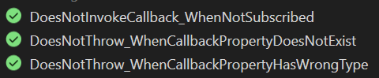
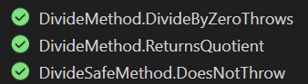
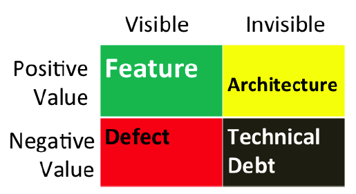
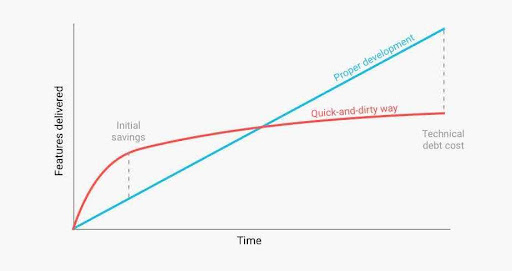
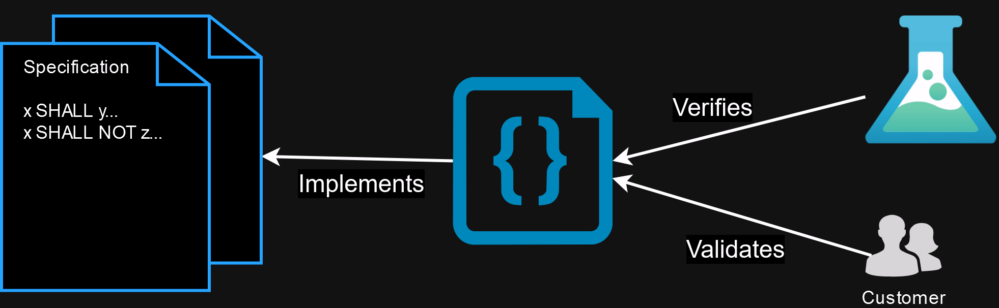
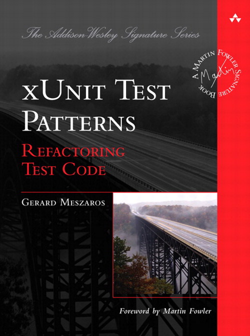

About Me
---
<!-- incremental_lists: true -->
<!-- pause -->
- Coding since 1999
- BS Computer Science 2013
- MS Computer Science 2014
- C#, C++, Python
- 10 years medical device software
- Been part of robust QA programs

Contents
---
<!-- incremental_lists: true -->

- Goals
- Definitions
  - What is a unit?
  - What is a unit test?
  - What isn't a unit test?
- Principles of Unit Testing
  - Why add unit tests?
  - Design and tests
  - Good tests
  - Test philosophy
  - Common Test Smells
- Special Consideration: Legacy Code
- Resources

Goals
---
<!-- incremental_lists: true -->

<!-- pause -->
- Spark a dialog and shared narrative about software quality at Climavision
- Show the relationship between software design and testing
- Foretell the benefits of testing

<!-- pause -->
Non-goals:

<!-- pause -->
- Preach opinions
- Prescribe which frameworks to use (e.g. `NUnit`, `xUnit`, `GTest`, `unittest`)
- Talk about system/customer/end-to-end tests 
  - i.e. tests that can't run from Test Explorer in one `.sln`
  - i.e. tests using cURL, Postman, etc.
  - They quickly become a discussion about deployments, environments, accounts, and firewalls.

Definitions
---

Definitions > What is a unit?
---

# What is a unit?

<!-- pause -->
- ❌ Not physical: 
  - exe
  - DLL
  - class
  - function/method
  - assembly instruction

<!-- pause -->
- ✅ Conceptual: 
  - An indivisible design choice
  - and its *assumptions* and its *guarantees*
  - aka its *preconditions* and *postconditions*
  - aka its contract

<!-- pause -->
# Example: Identify the units

<!-- pause -->
```csharp
public class Calculator
{
    // What if y == 0 ?
    public int Divide(int x, int y) => x / y;

    // Stronger guarantees
    public int DivideSafe(int x, int y) => y switch
    {
        0 => int.MaxValue,
        _ => x / y
    };
}
```

Definitions > What is a unit test?
---

# What is a unit test?

<!-- pause -->
<!-- column_layout: [2, 1] -->
<!-- column: 0 -->
*Naive answer*: A row in Test Explorer

<!-- column: 1 -->

<!-- reset_layout -->

<!-- pause -->
*Better answer*: runnable code that verifies a specification is met


<!-- pause -->
## Example

```csharp

public class DivideMethod
{
    [Fact]
    public void ReturnsQuotient() =>
        new Calculator()
          .Divide(8, 2)
          .Should().Be(4);

    [Fact]
    public void Throws() => new Action(() =>
        new Calculator()
          .Divide(8, 0))
          .Should().Throw<DivideByZeroException>();
}

public class DivideSafeMethod
{
    [Fact]
    public void DoesNotThrow() => new Action(() =>
        new Calculator()
          .DivideSafe(8, 0))
          .Should().NotThrow();
}

```




Definitions > What isn't a unit test?
---
<!-- incremental_lists: true -->
<!-- pause -->

# What isn't a unit test?
<!-- pause -->

- A test that fails ambiguously
<!-- pause -->

```csharp

// A unit with a dependency, hardcoded.
public class Foo
{
    private readonly IBar bar = new Bar();
    public int DoFoo() => bar.DoBar();
}

// If this test fails, is it Foo or Bar's fault?
public class DoFooMethod
{
    [Fact]
    public void Foos() => new Foo().DoFoo().Should().Be(42);
}
```

<!-- pause -->
- On the physical level, the above is a unit test.
- On the design level, it is not.
  - It's an integration / composite test.


- How to make it a unit?
- Use a test double

```csharp

public interface IBar { int DoBar();  }
public class FakeBar : IBar { public int DoBar() => 42; }

// A unit with a dependency, injected
public class Foo(IBar bar)
{
    public int DoFoo() => bar.DoBar();
}
```

Principles of Unit Testing
---

Principles of Unit Testing > Why add unit tests?
---

# Why add unit tests?
<!-- pause -->


<!-- pause -->

<!-- pause -->

<!-- incremental_lists: true -->
- Deliver faster (in the long run)
- Reduce risk
- Improve quality
- Repel bugs
- Localize defects
- Safety net
  - Like a circus acrobat, proceed with confidence
- Tests as documentation
- **Tests as specification**


Principles of Unit Testing > Design and Tests
---
<!-- incremental_lists: true -->

There is a relationship between testing and design.
<!-- pause -->

It's the specification.
<!-- pause -->

# What is a specification?

<!-- pause -->
- The primary artifact of software development isn't code.
- i.e. it's an unambiguous, authoritative description of what the software should do.
- We help businesses and customers discover it. (Fred Brooks, *Design of Design*)

<!-- pause -->


<!-- pause -->
- In most orgs, the spec is not written down.
- It is left implied in the code or in developer's minds.
- Gets lost if original contributors leave.
- It is very hard to reverse a specification from a large codebase.
- Standards (open specifications) are powerful.
- Example specifications
  - Web standards (W3C) 
    - Implemented by all major browsers
    - https://www.w3.org/standards/
  - The C++ Standard (ISO 14882) 
    - Implemented by e.g. clang, gcc, intel, msvc
    - https://isocpp.org/std/the-standard
  - .NET C# and CLI (ECMA-334, 335) 
    - Implemented by e.g. .NET Framework, .NET Core, Mono.
    - https://learn.microsoft.com/en-us/dotnet/fundamentals/standards
  - SQL
    - https://www.iso.org/standard/76583.html

Principles of Unit Testing > Design and Tests
---
<!-- incremental_lists: true -->

# Specification as Code
<!-- pause -->
- We can use tests to capture and preserve the spec
- Tests also verify the program meets the spec

```csharp
public class FooTests
{
    [Fact]
    // The name and result of this test form a specification!
    public void Foo_DoesThing_WhenCondition() { ... }
}
```

<!-- pause -->
# Testing improves Design
<!-- pause -->

- When we write tests before or as we write the code, the code is designed better.
- Example: statically declaring dependencies via dependency injection

```csharp
public class SomeService(ISomeDependency dep) { ... }
```

instead of

```csharp
public class SomeService() 
{
    private readonly SomeDependency _dep = new(...);
}
```

Principles of Unit Testing > Design and Tests
--- 

- Example: minimizing side-effects and state
<!-- pause-->

<!-- column_layout: [1, 1] -->
<!-- column: 0 -->
Bad:

```csharp
public class Effectful
{
    public int Count { get; private set; }
    public void Add(int i) => Count += i;
}

public class AddMethod
{
    private Effectful effectful = new();

    // These tests cannot run in parallel!
    [Fact]
    public void Adds()
    {
        effectful.Add(5);
        effectful.Add(3);
        effectful.Add(2);
        effectful.Count.Should().Be(10);
    }

    [Fact]
    public void Adds2()
    {
        effectful.Add(11);
        effectful.Count.Should().Be(11);
    }
}
```

<!-- pause-->
<!-- column: 1 -->
Better:
```csharp
public class Stateless
{
    public int Add(int x, int y) => x + y;
}

public class AddMethod
{
    // Can run in parallel
    [Fact]
    public void AddMethod()
    {
        var stateless = new Stateless();
        var sum = stateless.Add(5, 3);
        var sum2 = stateless.Add(sum, 2);
        sum2.Should().Be(10);
    }
}
```


Good tests
---
<!-- incremental_lists: true -->

Tests are *not without cost*!

<!-- pause -->
Test maintenance can be expensive and depressing.

<!-- pause -->
Goals for tests:

- Simple. Verify one condition per test. One code path (no `if`).
- Expressive. Use *test utility methods*.
- Short. 10 lines is about the longest a test should be!
- Robust. Write test so that any one change breaks very few tests (but at least one).

- Prefer the front door i.e. public interface
- Communicate intent
- Minimize test overlap
- Minimize untestable code
- Test concerns separately
- Use Test Doubles 

Common Test Smells
---
<!-- incremental_lists: true -->

- Conditional test logic
- Hard-coded test data
- Test code duplication (copy-paste)
- Fragile tests
- Erratic tests
  - Data races
  - Resource contention e.g. bound ports, locked files

Test Philosphy
---
<!-- incremental_lists: true -->

- "test after" vs "test first"
- test-by-test vs all-at-once
- "outside in" versus "inside out"
- behavior vs state verification
- fixture-per-test, shared fixture

<!-- pause -->
(Informed) Opinions!

Prefer:

<!-- pause -->
- write tests first, or immediately with, code
- write test one at a time, or a few related at at ime
- outside in
- state verification
- 1 fixture per test. e.g. no shared DB for all tests.

Special Case: Legacy Code
---

> By definition, legacy code doesn’t have a suite of automated regression tests. - Gerard Meszaros, xUnit Test Patterns

<!-- pause -->
# Characterization tests

<!-- pause -->
Retrofitting tests implies
rediscovery of the specification

<!-- pause -->
Mental picture: Like a graphing calculator plotting a curve.

<!-- pause -->
```csharp
public class MysteryService
{
    public int Mystery(int d) => ???; 
} 

public class MysteryMethod
{
    [Theory]
    [InlineData(-2, 2)]
    [InlineData(-1, 1)]
    [InlineData(0, 0)]
    [InlineData(1, 1)] 
    [InlineData(2, 2)]
    [InlineData(2, 3)] // Fails
    public void Characterize(int input, int output) => 
        new MysteryService().Mystery(input)
            .Should().Be(output);
}
```

<!-- pause -->
| Input  |  Output  |
| ------ | -------- |
| -2     | 2        |
| -1     | 1        |
|  0     | 0        |
|  1     | 1        |
|  2     | 2        |


<!-- pause -->
```csharp
public class MysteryService
{
    public int Mystery(int d) => Math.Abs(d):
}
```

Resources
---

[](https://blog.ploeh.dk/2023/02/13/epistemology-of-interaction-testing/)

[](https://martinfowler.com/tags/testing.html)

[](http://xunitpatterns.com)




Discussion
---

