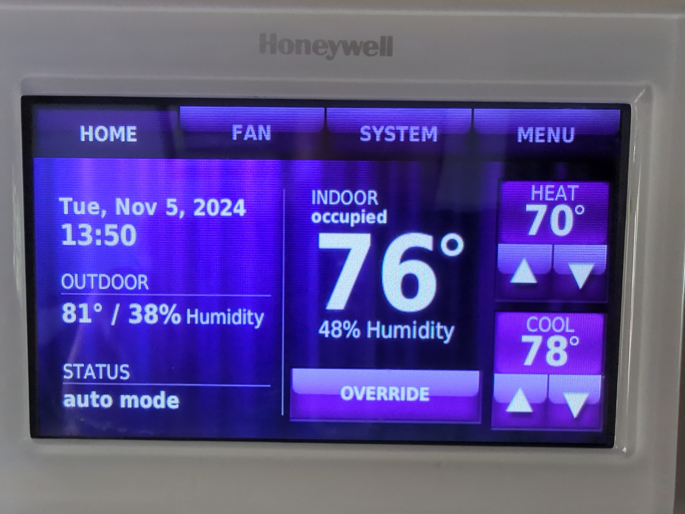

Contents
---
<!-- incremental_lists: true -->

<!-- pause -->
- Quiz from last talk
- Goals
- Intro
- State
  - Abstract State
  - Concrete State
- The Representable/Valid Principle (RVP)
- MIRO
  - Applying MIRO
- Quiz
- Summary
- Resources


Quiz from last talk
---
<!-- incremental_lists: true -->

<!-- pause -->
- Q: Code units A and B are coupled if, whenever ___ changes, ___ is also likely to change.
  - **A: A, B**
- Q: Your program was written via some tree of ___ and ___.
  - **A: assumptions, decisions**
- Q: The easier it is to ___ the design from the code, the more ___ it is.
  - **A: reverse-engineer, EDP-compliant** (Embedded Design Principle)
- Q: The ___ checks if code matches its natural language description
  - **A: Plain English Test**
- Q: ___ Antipatterns describe poor choice of words in the code
  - **A: Linguistic**


Goals
---
<!-- incremental_lists: true -->

- Define state, abstract state, and concrete state
- Define the Representable/Valid principle
- Learn MIRO: The 4 incorrect mappings between abstract state and concrete state
- Make bugs impossible

Intro
---
<!-- incremental_lists: true -->

<!-- pause -->
> "Make illegal states unrepresentable"

<!-- pause -->
We've all heard that.

<!-- pause -->
What does it mean?

State
---
<!-- incremental_lists: true -->

<!-- pause -->
What is state?

<!-- pause -->
**State** is information about the world that can change.

<!-- pause -->
Examples:

<!-- pause -->
- The wifi is connected.
- The patient's heart rate is 62.
- The wind speed is 100 knots.
- The car dashboard message says "LOW TIRE PRESSURE".

Abstract State
---
<!-- incremental_lists: true -->

<!-- pause -->
An **abstraction** is a mapping from a complex set to a simpler one.

<!-- pause -->
Q: What is abstract state?

<!-- pause -->
## Abstract state

- An **abstract state** is a simpler but useful model of reality

<!-- pause -->


<!-- pause -->
<!-- column_layout: [2, 1] -->

<!-- column: 1 -->


<!-- column: 0 -->

**Q: How would you model a smart thermostat?**

<!-- pause -->
You might include:

<!-- pause -->
- Whether the heat is on
- Whether the cooling is on
- The heat setpoint
- The cool setpoint
- The inside temperature
- The outside temperature

<!-- pause -->
This is an abstract state for a smart thermostat.

<!-- pause -->
The abstract state discards information about reality that is not useful:

<!-- pause -->
- Voltage in the control wires
- Whether the heater is gas or electric
- The cost of gas or electricity
- Whether the outside temperature comes from a sensor or a web service

Concrete State
---
<!-- incremental_lists: true -->

<!-- column_layout: [2, 1] -->

<!-- column: 1 -->


<!-- column: 0 -->

Q: What is concrete state?
<!-- pause -->

## Concrete state

<!-- pause -->
- The **concrete state** is the data types in code that *represent* the abstract state.

<!-- pause -->


<!-- pause -->
```csharp
bool IsWifiConnected
int PatientHeartRateBpm
double WindSpeedKnots
string DashboardMessage
```

<!-- pause -->
```csharp
bool IsHeatOn
bool IsCoolOn
int HeatSetpoint
int CoolSetpoint
int InsideTemp
int OutsideTemp
```

<!-- reset_layout -->


The Representable/Valid Principle (RVP)
---

<!-- pause -->
## Representable/Valid Principle (RVP)

*Keep a one-to-one correspondence between representable and valid states of the program.*

<!-- pause -->


<!-- pause -->
In other words, make it impossible to even represent bugs.

<!-- pause -->
How do we do that?

MIRO
---
<!-- incremental_lists: true -->

<!-- column_layout: [2, 1] -->
<!-- column: 1 -->

<!-- column: 0 -->
<!-- pause -->
In keeping with the RVP, we want a one-to-one mapping between the abstract state and concrete state.

<!-- pause -->
**MIRO** is an acronym for the 4 incorrect mappings:

<!-- pause -->
- **M**issing
- **I**llegal
- **R**edundant
- **O**verloaded

<!-- pause -->


<!-- reset_layout-->

Missing States
---
<!-- incremental_lists: true -->

<!-- column_layout: [2, 1] -->

<!-- column: 1 -->


<!-- column: 0 -->
<!-- pause -->
-> There are abstract states that the concrete states cannot express.

<!-- pause -->
Example: Not having an `Error` or `Option` state

<!-- pause -->
```csharp
int OutsideTemperature { get; set; } 
```

<!-- pause -->
- What if the value is not known?
- There are two abstract states: value known, not known
- There is one concrete state: the value

<!-- pause -->
Slightly better:
<!-- pause -->
```csharp
int? OutsideTemperature { get; set; } // null: Value not known
```

<!-- reset_layout -->


Illegal States
---
<!-- incremental_lists: true -->

<!-- column_layout: [2, 1] -->

<!-- column: 1 -->


<!-- column: 0 -->
<!-- pause -->
-> There are concrete states that have no mapping to an abstract state.

<!-- pause -->
Example: A setting that enables other settings

<!-- pause -->
```csharp
record User(bool IsAdmin, bool CanSetUserPasswords);

User(true, true)    // OK
User(true, false)   // OK
User(false, true)   // illegal
User(false, false)  // OK
```

<!-- pause -->
- `CanSetUserPasswords` should not be true when `IsAdmin` is `false`.
- There are 3 abstract states, 4 concrete

<!-- pause -->
Better:
<!-- pause -->
```csharp
abstract record Role;
record Admin(bool CanSetUserPasswords) : Role;
record RegularUser : Role;
```

<!-- reset_layout -->


Redundant States
---
<!-- incremental_lists: true -->

<!-- column_layout: [2, 1] -->

<!-- column: 1 -->


<!-- column: 0 -->
<!-- pause -->
-> There is more than one way to represent an abstract state.

<!-- pause -->
Example:

<!-- pause -->
```csharp
record Thermostat(bool IsOn, bool IsHeatOn);

Thermostat(false, false)  // redundant
Thermostat(false, true)   // illegal
Thermostat(true, false)   // illegal
Thermostat(true, true)    // redundant
```

<!-- pause -->
- There are two abstract states: on, off
- There are four concrete states. Two illegal, two redundant

<!-- pause -->
Slightly Better:
<!-- pause -->
```csharp
record Thermostat(bool IsHeatOn)
{
    public bool IsOn => IsHeatOn;
}
```

<!-- reset_layout -->


Overloaded States
---
<!-- incremental_lists: true -->

<!-- column_layout: [2, 1] -->

<!-- column: 1 -->


<!-- column: 0 -->
<!-- pause -->
-> There is one concrete state representing two or more abstract states.

<!-- pause -->
Example: A chat app that says "no messages", then suddenly shows them.

<!-- pause -->
The app cannot represent the difference between the abstract states 
  - "haven't fetched messages yet"
  - "fetching messages" 
  - "fetching messages failed"
  - "there are no messages"


<!-- pause -->
```csharp
record State(string[] Messages)
```

<!-- pause -->
- There are 4 abstract states: not fetched, fetching, fetched, failed
- There are 2 concrete states: empty list, nonempty list

<!-- pause -->
Better:
<!-- pause -->
```csharp
abstract record State;
record NotFetched : State;
record Fetching : State;
record Fetched(string[] Messages) : State;
record Failed(string ErrorMessage) : State;
```

<!-- reset_layout -->


Applying MIRO
---
<!-- incremental_lists: true -->

<!-- pause -->

<!-- column_layout: [1, 1] -->

<!-- column: 0 -->
Recall our abstract state for a thermostat:

<!-- pause -->
- Whether the heat is on
- Whether the cooling is on
- The heat setpoint
- The cool setpoint
- The inside temperature
- The outside temperature

<!-- pause -->
Consider this error-prone concrete state:

<!-- pause -->
```csharp

record BuggyThermostat(
    bool IsOn, 
    bool IsHeatOn, 
    bool IsCoolOn, 
    int Setpoint, 
    int InsideTemp, 
    int? OutsideTemp = null);
```

<!-- pause -->
What's wrong with it?

<!-- pause -->
- Missing state
  - There is only one setpoint, but the UI lets the user set two.
- Illegal states
  - `IsHeatOn` and `IsCoolOn` could both be true
  - `IsOn` could be `false` but there is a setpoint
  - `IsOn` could be `false` while `IsHeatOn` or `IsCoolOn` are `true`
  - It's possible to mix celsius and fahrenheit.
  - It's possible to assign a temperature reading as the setpoint or vice versa.
- Redundant state
  - `IsOn` is implied by `IsHeatOn || IsCoolOn`
- Overloaded states
  - What does `null` mean? 
    - Haven't fetched? 
    - Currently fetching? 
    - Server returned no data?

<!-- pause -->
For maximum shenanigans:

<!-- pause -->
```csharp
new BuggyThermostat(
   IsOn: false,
   IsHeatOn: true,
   IsCoolOn: true,
   Setpoint: 25, // Comfortable in Celsius
   InsideTemp: 72,
   OutsideTemp: null); // Who knows why!
```
<!-- column: 1 -->

<!-- pause -->
One solution:
- Use the C# type system to make these bugs unrepresentable.
- The bugs will not even compile.
- Bonus: It is EDP-compliant

<!-- pause -->
```csharp
abstract record Unit(int Value);
record Fahrenheit(int Value) : Unit(Value);
record Celsius(int Value) : Unit(Value);
```

<!-- pause -->
```csharp
abstract record Temperature(Unit Value);
record Setpoint(Unit Value) : Temperature(Value);
record Reading(Unit Value) : Temperature(Value);
```

<!-- pause -->
```csharp
abstract record RunState;
record OffState : RunState;
record HeatState(Setpoint Setpoint) : RunState;
record CoolState(Setpoint Setpoint) : RunState;
```

<!-- pause -->
```csharp
abstract record FetchState;
record NotFetched : FetchState;
record FetchInProgress : FetchState;
record FetchError(string Message) : FetchState;
record Fetched(Reading Temperature) : FetchState;
```

<!-- pause -->
The new thermostat:

<!-- pause -->
```csharp
record BetterThermostat(
    RunState RunState, 
    Reading InsideTemp, 
    FetchState OutsideTemp);
```

<!-- pause -->
Example use:

<!-- pause -->
```csharp
var thermostat = new BetterThermostat(
    new HeatState(new Setpoint(new Celsius(25))),
    new Reading(new Fahrenheit(72)),
    new FetchInProgress());
```

<!-- reset_layout -->


Applying MIRO
---
<!-- incremental_lists: true -->

<!-- pause -->
Q: Why is `BetterThermostat` better?

<!-- pause -->
A: It's impossible to write a bug.

<!-- pause -->
Let's look at validation logic for `BuggyThermostat` and `BetterThermostat`.

<!-- pause -->
<!-- column_layout: [1, 1] -->

<!-- column: 0 -->
```csharp
new BuggyThermostat(
   IsOn: false,
   IsHeatOn: true,
   IsCoolOn: true,
   Setpoint: 25, // Comfortable in Celsius
   InsideTemp: 72,
   OutsideTemp: null); // Who knows why!
```

<!-- column: 1 -->
```csharp
record BetterThermostat(
    RunState RunState, 
    Reading InsideTemp, 
    FetchState OutsideTemp);
```
<!-- reset_layout -->

<!-- column_layout: [1, 1] -->

<!-- pause -->
<!-- column: 0 -->
```csharp
bool IsValid(BuggyThermostat t) =>
     (  (t.IsOn &&  (t.IsHeatOn || t.IsCoolOn)) 
    || (!t.IsOn && !(t.IsHeatOn || t.IsCoolOn))  )
  && !(t.IsHeatOn && t.IsCoolOn)
  && ((t.IsOn && t.Setpoint >= 0) || (!t.IsOn && t.Setpoint < 0));
```

<!-- pause -->
<!-- column: 1 -->
```csharp
bool IsValid(BetterThermostat t) => true;
```
<!-- reset_layout -->

<!-- pause -->
<!-- column_layout: [1, 1, 1] -->
<!-- column: 1 -->
- What are the chances there is a bug on the left?
- What are the chances there is a bug on the right?
- Design view: We moved risk from runtime to compile time
<!-- reset_layout -->

Quiz
---
<!-- incremental_lists: true -->
<!-- pause -->
- Q: An _____ is a mapping from a complex set to a simpler one.
  - **A: abstraction**
- Q: The _____ is a simpler but useful model of reality
  - **A: abstract state**
- Q: The ____ is the data types in code that *represent* the abstract state.
  - **A: concrete state**
- Q: The 4 incorrect mappings between abstract state and concrete state are...
<!-- column_layout: [1, 1, 1, 10] -->
<!-- column: 1 -->
<!-- pause -->
**M**____
<!-- pause -->
**I**____
<!-- pause -->
**R**____
<!-- pause -->
**O**____
<!-- column: 2 -->
<!-- pause -->
**Missing**
<!-- pause -->
**Illegal**
<!-- pause -->
**Redundant**
<!-- pause -->
**Overloaded**
<!-- reset_layout -->
<!-- pause -->
- Q: The ____ keeps a one-to-one correspondence between representable and valid states of the program.
  - **A: Representable/Valid Principle (RVP)**


Summary
---
<!-- incremental_lists: true -->

<!-- pause -->
- Defensive code is a smell. It implies the possibility for bugs.

<!-- pause -->
```csharp
// I smell bugs
try {
  bool ok = DoThing();
  if (!ok) ...
}
catch (SomeException) {
 ...
}
catch (OtherException) {
  ...
}
```

<!-- pause -->
- Often manifests as conditionals and `try`.
- A program with no representable invalid states cannot have bugs.

<!-- pause -->
```csharp
bool IsValid(BetterThermostat t) => true;
```

<!-- pause -->
## Principle:

<!-- pause -->
The power of a design isn't how much it can do, it's what it can't do.


Resources
---

- [](https://note89.github.io/state-of-emergency/)
- [](https://github.com/nref/speaking/tree/main/representable_valid_principle)

Discussion
---
